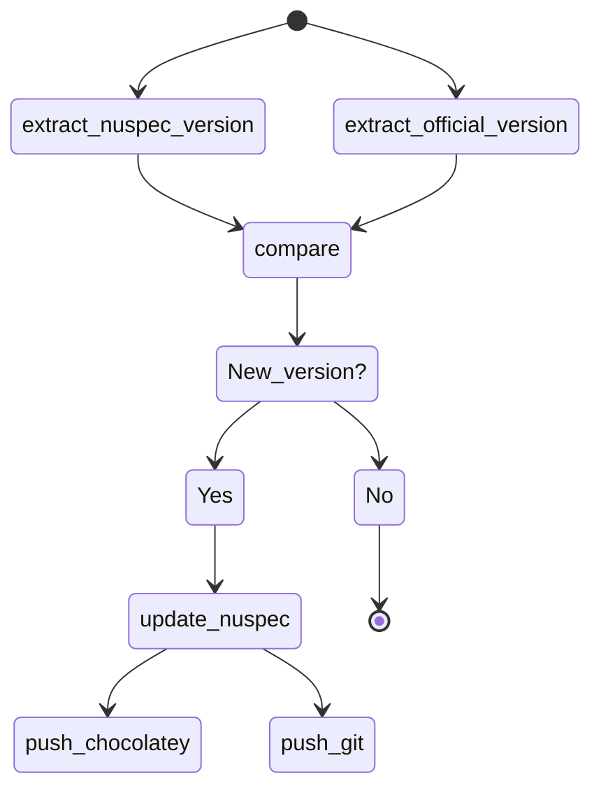

# Automatic update of Chocolatey packages

Github is the perfect Git repository to manage:

1. the source repository for chocolatey packages
2. regular checking of packages updates
3. automatic sending of packages to chocolatey as needed

---

Here are deposited:

* the script (*.ps1*) for making the package + sending
* the folder containing the files needed to manufacture the package
* the scripts (*.yml*) of github actions allowing the regular checking of updates and the launching of the scripts of packaging/sending

---

✔ It is possible to **directly download the .nupkg packages** from the [releases](https://github.com/A-d-r-i/update_choco_package/releases) if needed! Of course it is always better to install the packages from chocolatey (the packages are tested and verified).

---
| Name | Cycle | Automatic version | Automatic changelog | Official link | Chocolatey link |
|:---:|:---:|:---:|:---:|:---:|:---:|
| **Affine Client** | Every 2 hours | ✅ | ✅ | [Link](https://affine.pro/) | [Link](https://community.chocolatey.org/packages/affine-client) |
| **Audiomoth Config App** | Every 2 hours | ✅ | ✅ | [Link](https://www.openacousticdevices.info/applications) | [Link](https://community.chocolatey.org/packages/audiomoth-config) |
| **Audiomoth Flash App** | Every 2 hours | ✅ | ✅ | [Link](https://www.openacousticdevices.info/applications) | [Link](https://community.chocolatey.org/packages/audiomoth-flash) |
| **Audiomoth Time App** | Every 2 hours | ✅ | ✅ | [Link](https://www.openacousticdevices.info/applications) | [Link](https://community.chocolatey.org/packages/audiomoth-time) |
| **Audiomoth USB Microphone App** | Every 2 hours | ✅ | ✅ | [Link](https://www.openacousticdevices.info/applications) | [Link](https://community.chocolatey.org/packages/audiomoth-usb) |
| **CTemplar** | Unmaintained [^1] | ❌ | ❌ | [Link](https://ctemplar.com) | [Link](https://community.chocolatey.org/packages/ctemplar) |
| **Dot Browser** (*Alpha*) | Every 2 hours | ✅ | ✅ | [Link](https://www.dothq.co/) | [Link](https://community.chocolatey.org/packages/dotbrowser) |
| **DotDotGoose** | Every 2 hours & Manually [^2] | ✅ | ✅ | [Link](https://biodiversityinformatics.amnh.org/open_source/dotdotgoose/) | [Link](https://community.chocolatey.org/packages/dotdotgoose) |
| **Filen** | Every 2 hours | ✅ | ✅ | [Link](https://filen.io/) | [Link](https://community.chocolatey.org/packages/filen) |
| **FireDM** | Unmaintained [^3] | ❌ | ❌ | [Link](https://github.com/firedm) | [Link](https://community.chocolatey.org/packages/firedm) |
| **FluffyChat** | Every 2 hours | ✅ | ✅ | [Link](https://fluffychat.im/) | [Link](https://community.chocolatey.org/packages/fluffychat) |
| **HomeBank** | Every 2 hours | ✅ | ✅ | [Link](homebank.free.fr) | [Link](https://community.chocolatey.org/packages/homebank) |
| **L0phtCrack** | Every 2 hours | ✅ | ✅ | [Link](https://l0phtcrack.gitlab.io/) | [Link](https://community.chocolatey.org/packages/l0phtcrack) |
| **Mendeley Reference Manager** | Every 2 hours | ✅ | ✅ | [Link](https://www.mendeley.com/reference-management/reference-manager) | [Link](https://community.chocolatey.org/packages/mendeley-reference-manager) |
| **Open Video Downloader** | Every 2 hours | ✅ | ✅ | [Link](https://jely2002.github.io/youtube-dl-gui/) | [Link](https://community.chocolatey.org/packages/open-video-downloader) |
| **Raven Reader** | Every 2 hours | ✅ | ✅ | [Link](https://ravenreader.app) | [Link](https://community.chocolatey.org/packages/raven) |
| **Saucedacity** | Every 2 hours | ✅ | ✅ | [Link](https://saucedacity.github.io/) | [Link](https://community.chocolatey.org/packages/saucedacity) |
| **Sengi** | Every 2 hours | ✅ | ✅ | [Link](https://nicolasconstant.github.io/sengi) | [Link](https://community.chocolatey.org/packages/sengi) |
| **Tartube** | Every 2 hours | ✅ | ✅ | [Link](https://tartube.sourceforge.io) | [Link](https://community.chocolatey.org/packages/tartube) |
| **Tenacity Audio Editor** | Every 2 hours | ✅ | ✅ | [Link](https://tenacityaudio.org) | [Link](https://community.chocolatey.org/packages/tenacity) |
| **Tutanota** | Every 2 hours | ✅ | ✅ | [Link](https://tutanota.com) | [Link](https://community.chocolatey.org/packages/tutanota) |

[^1]: *CTemplar* - Not longer maintained by his creators ([CTemplar website](https://ctemplar.com/ctemplar-is-shutting-down/))
[^2]: *DotDotGoose - [Issue 10](https://github.com/A-d-r-i/update_choco_package/issues/10)*  
[^3]: *FireDM* - Not longer maintained by his creators ([GitHub](https://github.com/firedm))

